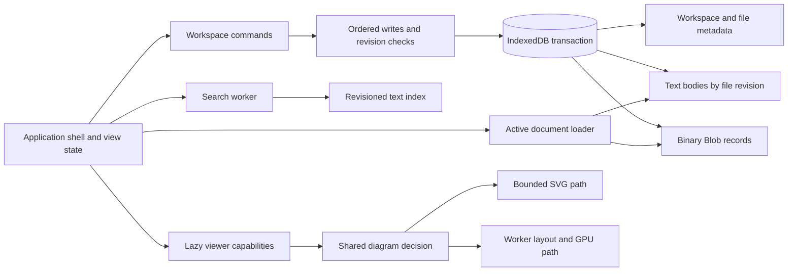

**Localdox — prioritized implementation plan**

This plan addresses the findings in [REPORT.md](REPORT.md). It proposes changes; application code has not been modified by the audit. Estimates are engineering effort ranges, not delivery commitments. The quality gate is dependable data, predictable interaction, and bounded work under realistic load.

**Recommended order**

| Order | Work package / owner discipline                       | Scope                                                                                                                                     | Estimate | Completion gate                                                                                                                                            |
| ----- | ----------------------------------------------------- | ----------------------------------------------------------------------------------------------------------------------------------------- | -------- | ---------------------------------------------------------------------------------------------------------------------------------------------------------- |
| 1     | Backup fidelity / persistence                         | A02, D05: versioned import/export schema, `saved` and `deletedAt` preservation, duplicate-ID and folder validation, decoded-size bounds   | 2–3 days | Every supported record survives export → clear isolated test DB → import → reload; malformed or over-budget imports commit nothing                         |
| 2     | Transaction safety / persistence                      | A01, D04, D06: expected revisions, per-workspace write ordering, conflict preservation, atomic moves, committed key writes                | 3–5 days | Two tabs cannot silently erase edits or resurrect a deleted workspace; injected aborts leave original state recoverable; failed moves never report success |
| 3     | Visible durability and sharing / product + frontend   | A03, A10, A11: save state, durable draft recovery, retry/export, share preview, Bin exclusion, offline shell and capability state         | 4–6 days | Recent edits recover after forced close; failed saves remain visible; share payload is reviewable; downloaded local capabilities reopen offline            |
| 4     | Search correctness / search + frontend                | A06, A07: revisioned index protocol, serialized mutations, renamed metadata, worker lifecycle/error handling                              | 2–3 days | Rename/edit/delete, rapid typing, cross-workspace reopen, and forced worker failure all produce correct settled results                                    |
| 5     | Heavy-viewer bounds / rendering                       | A04, A05, A08, R01–R04: common diagram routing, bounded walkthrough viewport, incremental Markdown, PDF pixel budget, scoped input        | 5–8 days | 500/600/1,000-edge transitions stay usable; long-document input meets latency gates; PDF zoom respects memory budget                                       |
| 6     | Startup and storage scaling / performance             | B01–B03, D01–D03: remove export server renderer from entry graph, lazy reader/editor/fallback, metadata/text/blob APIs, bounded ingestion | 4–7 days | Empty app fetches only shell capabilities; opening one note fetches no unrelated binaries; incremental saves remain incremental                            |
| 7     | Interaction and accessibility / design + frontend     | A09 and UX recommendations: accessible drawer, zoom, action hierarchy, naming dialogs, toast theme, mobile PDF mode decision              | 3–5 days | Keyboard and touch critical journeys pass; zoom/reflow work; primary tasks are discoverable without instruction                                            |
| 8     | Provider/runtime hardening and enforcement / platform | A12, B04–B05, R05–R06: supported models, streaming ownership, import retry, lazy runtime budgets, CI rules                                | 2–4 days | Retired IDs migrate safely; stale requests cannot alter current output; update/reload preserves drafts; budgets fail in CI                                 |

Total planning allowance: roughly **25–41 engineer-days**, with overlap possible once the durability contracts are agreed. Do not postpone P0 fixes behind a visual redesign. Ship small validated changes; avoid combining schema migration, renderer replacement, and navigation redesign in one release.

**First reviewable changes**

1. **PR: faithful backup schema.** Add export/import round-trip tests containing a saved table/code block with a note, highlights with anchors, binned files, nested folders, two panes, and conversion derivations. Define validation and migration rules. Keep old backups readable. Explicitly distinguish backup exports from public share payloads.
2. **PR: revision-checked transactions.** Make creation and updating different operations. Updating requires the revision read with that snapshot; creation must fail if the identity already exists. Serialize local mutations and make both sides of a move one transaction. Broadcast messages notify other tabs but never substitute for the database check. Conflict UI offers the latest saved version and preservation of the local draft.
3. **PR: diagram mode parity.** Create a shared `DiagramRenderDecision` from source complexity and observed render size. Pass it to Raw and Stepped; avoid running SVG layout again merely to rediscover an already-known limit. Give walkthrough mode a viewport-height cap. Regress the actual 500-edge failure before changing thresholds.
4. **PR: search protocol.** Introduce request IDs, workspace/document revisions, index generations, and a terminal error reply. Reject outstanding promises on termination. Clear lifecycle bookkeeping when recreating the worker. Include filename in invalidation and rerun the current query after successful sync.
5. **PR: accessible shell and save status.** Replace the custom modal drawer with the existing accessible sheet/dialog primitive. Restore zoom. Render pending/error/save state and add an explicit recoverable draft path before changing unload or reload behavior.

These first five changes create a trustworthy base for the broader performance work. Each should include only the regression tests that establish its contract.

**Target architecture**

Keep transient UI state separate from document content mutations. A focused-file or sidebar change should never carry stale content into a write. Metadata queries should not materialize file bodies. The database owns committed revisions; React owns the current view and recoverable draft. Search owns a derived index that can be rebuilt without changing authoritative revision bookkeeping.

Use Blob storage first for binary data. OPFS is an option for demonstrated large-file workloads, not an automatic upgrade. Preserve the current incremental file-write optimization and atomic migration behavior. A move or import needs a transaction contract before it needs a faster serializer.

**Proposed acceptance budgets**

These are product targets to calibrate on a named reference laptop and physical midrange phone. They are not claims about current performance or universal standards. Pin browser/build versions and retain distributions rather than only the fastest run.

| Journey                    | Proposed gate                                                                                                                                                                                 |
| -------------------------- | --------------------------------------------------------------------------------------------------------------------------------------------------------------------------------------------- |
| Empty cold launch          | ≤200 KiB compressed executable JS as an initial budget; median LCP ≤2.0 s in the audit throttle profile; field p75 meets the standard CWV baselines                                           |
| Common reading interaction | p95 click-to-next-paint ≤100 ms on the reference laptop; field INP p75 ≤200 ms                                                                                                                |
| 3,000-section Markdown     | First useful viewport ≤1 s warm on the reference laptop; no individual scheduled chunk intentionally monopolizes the main thread for >50 ms; input p95 ≤100 ms; bounded mounted section count |
| Workspace opening          | Cost primarily follows metadata plus active document, not total binary bytes; opening a 10 KB note in a workspace containing 100 MB of PDFs loads no PDF bodies                               |
| UI-only persistence        | Zero file payload puts, preserved from current behavior                                                                                                                                       |
| One-file persistence       | Exactly the changed file plus required metadata; visible error on aborted transaction; zero silent lost updates                                                                               |
| Search                     | Correct results within 200 ms after debounce on the agreed 1,000-document corpus; index progress is distinct from “no results”; error/termination always settles pending state                |
| Diagram playback           | Bounded stage height; controls remain visible; no offscreen playback work; target 60 fps on reference laptop and ≥30 fps on reference phone, measured on real devices                         |
| PDF zoom                   | Suggested cap ≤32 MiB backing pixels per visible page on desktop and ≤16 MiB on phone, with quality fallback; enforce a total multi-pane budget                                               |
| Conversion/import          | Visible progress/cancel within 100 ms of starting; cancellation stops worker work promptly; a failing file does not discard successful independent imports                                    |
| Accessibility              | Keyboard-complete critical tasks, contained/restored dialog focus, 200% text enlargement, 400% reflow, and useful accessible names/status announcements                                       |
| Recovery                   | Round-trip backups preserve all supported user state; close/reopen and quota/transaction failures preserve recoverable drafts; no upload without a clearly described share action             |

Do not use virtual DOM/windowing alone as the Markdown solution. First bound parsing, then mount work, then layout. Validate selection across sections, highlighted passages, anchor jumps, browser find, export, printing, and assistive navigation. Where windowing changes a native browser capability, provide an explicit equivalent or a full-document mode.

**Regression matrix to add**

| Area                 | Cases missing from the present assurance                                                                                                                                                   |
| -------------------- | ------------------------------------------------------------------------------------------------------------------------------------------------------------------------------------------ |
| Persistence          | Two-tab concurrent writes; tab A deletes while B saves; transaction abort and quota errors; v1→v2 interrupted migration; draft close at 50/300/650/1,200 ms; faithful backup restore       |
| Search               | Rename with unchanged content; edit with unchanged query; delete during indexing; cross-workspace close/reopen; worker crash; slow initial sync; non-English text                          |
| Diagram              | 499/500/599/600/1,000 edges; tall chains versus dense graphs; Raw↔Stepped↔Flow; theme and fullscreen; two diagrams in split panes; reduced motion; WebGL context loss; export cancellation |
| PDF                  | DPR 1/2/3, zoom 1×/4×, mixed page sizes, two-page spreads, two panes, 1,000-page search, huge outlines, failed page render, keyboard focus outside reader                                  |
| Storage scale        | 1,000/10,000 file metadata records, mixed 100 MB binaries, cross-workspace search, large restore, repeated open/close with post-GC retained-memory comparisons                             |
| UX and accessibility | Empty/import/read/edit/find/share/export/recover on desktop and touch; light/dark; keyboard only; real Safari/Firefox; screen reader; browser zoom; soft keyboard                          |

Run performance cases without concurrent build/test jobs. Use five repeated runs for change comparisons, capture median and p95 where the sample size supports it, and compare identical fixtures. Include a clean startup and a long-session scenario. The current audit deliberately does not certify memory leaks, frame rates, or mobile hardware performance.

**Release gate**

Approve a reliability release only after A01–A03 have reproductions that pass with the fixes and A09/A10 make saving and navigation usable. Approve a performance release only after A04/A05/A08 pass the same failing workloads and the new shell meets its measured entry budget. Re-review the visual system after those contracts are stable; otherwise polish will conceal unresolved behavior.
