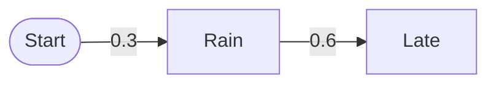

# Example course: every file of a valid upload

A complete two-topic study plan that imports cleanly; it was checked with Localdox's own importers. Zip these ten files together (any folder layout, unique names), for example as `prob-basics.zip`. Copy the shapes; change the content. Topics are named by subject (never "Day N"), and closing `:::` lines always sit alone at column 0.

## `prob-basics.plan.json`

````json
{
  "schemaVersion": 1,
  "id": "prob-basics",
  "name": "Probability basics",
  "description": "Two topics: learn, practise, pass the exam, review.",
  "days": [
    {
      "id": "conditional",
      "title": "Conditional probability",
      "examId": "prob-conditional",
      "summaryMd": "- Definition of $P(A \\mid B)$\n- Multiplication rule\n- Independent events",
      "tasks": [
        {
          "id": "lesson",
          "label": "Read the conditional probability lesson"
        }
      ],
      "practice": [
        "prob-conditional"
      ]
    },
    {
      "id": "bayes",
      "title": "Bayes' theorem",
      "examId": "prob-bayes",
      "summaryMd": "- Total probability\n- Bayes' theorem\n- Reading a probability tree",
      "practice": [
        "prob-bayes"
      ]
    }
  ]
}
````
## `prob-conditional.exam.json`

````json
{
  "schemaVersion": 2,
  "meta": { "id": "prob-conditional", "name": "Conditional probability", "version": "1", "instructionsMd": "Answer all four questions." },
  "timing": { "mode": "global", "durationMinutes": 12, "warnAtMinutesLeft": [2] },
  "sections": [{ "id": "main", "name": "Probability", "questionCount": 4 }],
  "questionTypes": {
    "mcq": { "optionCount": 4, "negativeMarking": { "fractionOfMarks": [1, 3] } },
    "msq": { "scoring": "all_or_nothing" },
    "nat": { "inputMode": "virtual_keypad" }
  },
  "attempts": { "max": 3 },
  "progression": { "passPercentage": 70, "rewriteDifficultyPercentage": 50, "difficultyLabel": "hard" },
  "results": { "scoreVisibility": "immediate", "solutionsRelease": "immediate_after_submit" },
  "diagnostics": { "enabled": false },
  "ui": { "profile": "gate", "kind": "quiz" }
}
````

## `prob-conditional.paper.md`

````markdown
:::question{#q1 section=main type=mcq marks=2 difficulty=medium}
Given $P(A \cap B) = 0.2$ and $P(B) = 0.5$, find $P(A \mid B)$.

- 0.1
- 0.2
- 0.4
- 0.7
:::

:::question{#q2 section=main type=nat marks=1 difficulty=easy}
A fair die is rolled. What is the probability of an even number? Give a decimal.
:::

:::question{#q3 section=main type=msq marks=2 difficulty=hard}
$A$ and $B$ are independent with $P(A) = 0.5$ and $P(B) = 0.4$. Select every true statement.

- $P(A \cap B) = 0.2$
- $P(A \mid B) = 0.5$
- $A$ and $B$ are mutually exclusive
- $P(A \cup B) = 0.9$
:::

:::question{#q4 section=main type=mcq marks=1 difficulty=easy}
Using the tree, what is $P(\text{Rain} \cap \text{Late})$?


- 0.18
- 0.07
- 0.25
- 0.9
:::
````

## `prob-conditional.solutions.md`

````markdown
:::solution{#q1 answer=C}
$P(A \mid B) = \dfrac{P(A \cap B)}{P(B)} = \dfrac{0.2}{0.5} = 0.4$.
:::

:::solution{#q2 answer=0.5 tolerance=0.01}
Three of the six faces are even, so $3/6 = 0.5$.
:::

:::solution{#q3 answer="A,B"}
Independence gives $P(A \cap B) = 0.5 \times 0.4 = 0.2$ and $P(A \mid B) = P(A) = 0.5$. They are not mutually exclusive because $P(A \cap B) \ne 0$, and $P(A \cup B) = 0.5 + 0.4 - 0.2 = 0.7$.
:::

:::solution{#q4 answer=A}
Multiply along the branch: $0.3 \times 0.6 = 0.18$.


:::
````

## `prob-conditional.practice.md`

````markdown
:::question{#p1 type=mcq marks=1}
Events $A$ and $B$ are independent with $P(A) = 0.3$ and $P(B) = 0.5$. Find $P(A \cap B)$.

- 0.15
- 0.8
- 0.2
:::

:::solution{#p1 answer=A}
Independence: $P(A \cap B) = P(A) P(B) = 0.15$.
:::

:::question{#p2 type=nat marks=1}
$P(A \cap B) = 0.12$ and $P(A) = 0.4$. Find $P(B \mid A)$.
:::

:::solution{#p2 answer=0.3 tolerance=0.001}
$P(B \mid A) = 0.12 / 0.4 = 0.3$.
:::
````

## `prob-bayes.exam.json`

````json
{
  "schemaVersion": 2,
  "meta": { "id": "prob-bayes", "name": "Bayes' theorem", "version": "1", "instructionsMd": "Answer all four questions." },
  "timing": { "mode": "global", "durationMinutes": 12, "warnAtMinutesLeft": [2] },
  "sections": [{ "id": "main", "name": "Probability", "questionCount": 4 }],
  "questionTypes": {
    "mcq": { "optionCount": 4, "negativeMarking": { "fractionOfMarks": [1, 3] } },
    "msq": { "scoring": "all_or_nothing" },
    "nat": { "inputMode": "virtual_keypad" }
  },
  "attempts": { "max": 3 },
  "progression": { "passPercentage": 70, "rewriteDifficultyPercentage": 50, "difficultyLabel": "hard" },
  "results": { "scoreVisibility": "immediate", "solutionsRelease": "immediate_after_submit" },
  "diagnostics": { "enabled": false },
  "ui": { "profile": "gate", "kind": "quiz" }
}
````

## `prob-bayes.paper.md`

````markdown
:::question{#q1 section=main type=mcq marks=2 difficulty=medium}
A test is 90% accurate for the disease and has a 5% false positive rate. 1% of people have the disease. Roughly what is $P(\text{disease} \mid \text{positive})$?

- 0.15
- 0.5
- 0.9
- 0.01
:::

:::question{#q2 section=main type=nat marks=1 difficulty=easy}
$P(A) = 0.6$, $P(B \mid A) = 0.5$. Find $P(A \cap B)$.
:::

:::question{#q3 section=main type=mcq marks=1 difficulty=hard}
Which statement is the law of total probability?

- $P(B) = \sum_i P(B \mid A_i) P(A_i)$
- $P(A \cup B) = P(A) + P(B)$
- $P(A \mid B) = P(A)$
- $P(A) + P(A^c) = 0$
:::

:::question{#q4 section=main type=mcq marks=1 difficulty=easy}
In the chart, which group has the higher positive rate?

```chart
{"type":"bar","title":"Positive tests per 100","data":[{"group":"Clinic","rate":12},{"group":"Screening","rate":4}],"series":[{"key":"rate","name":"Positives"}],"xKey":"group"}
```

- Clinic
- Screening
- Equal
- Cannot tell
:::
````

## `prob-bayes.solutions.md`

````markdown
:::solution{#q1 answer=A}
$P(+) = 0.9 \times 0.01 + 0.05 \times 0.99 = 0.0585$, so $P(D \mid +) = 0.009 / 0.0585 \approx 0.15$.
:::

:::solution{#q2 answer=0.3 tolerance=0.001}
$P(A \cap B) = P(B \mid A) P(A) = 0.5 \times 0.6 = 0.3$.
:::

:::solution{#q3 answer=A}
Total probability sums $B$'s probability over a partition $A_1, A_2, \dots$.
:::

:::solution{#q4 answer=A}
The clinic bar (12) is taller than screening (4).
:::
````

## `prob-bayes.practice.md`

````markdown
:::question{#p1 type=msq marks=1}
Which are needed to apply Bayes' theorem for $P(A \mid B)$?

- $P(B \mid A)$
- $P(A)$
- $P(B)$
- $P(A \cup B)$
:::

:::solution{#p1 answer="A,B,C"}
$P(A \mid B) = P(B \mid A) P(A) / P(B)$.
:::
````

## `rain-tree.svg`

````svg
<svg xmlns="http://www.w3.org/2000/svg" viewBox="0 0 320 160" width="320" height="160" font-family="system-ui, sans-serif" font-size="13">
  <title>Probability tree: Rain 0.3 then Late 0.6; No rain 0.7 then Late 0.1</title>
  <g stroke="#5b6270" stroke-width="2" fill="none">
    <path d="M20 80 L120 40"/><path d="M20 80 L120 120"/>
    <path d="M150 40 L250 25"/><path d="M150 120 L250 135"/>
  </g>
  <g fill="#111318">
    <text x="125" y="44">Rain</text><text x="125" y="124">No rain</text>
    <text x="255" y="29">Late</text><text x="255" y="139">Late</text>
  </g>
  <g fill="#4f5bd5" font-weight="600">
    <text x="55" y="50">0.3</text><text x="55" y="118">0.7</text>
    <text x="190" y="26">0.6</text><text x="190" y="140">0.1</text>
  </g>
</svg>
````
