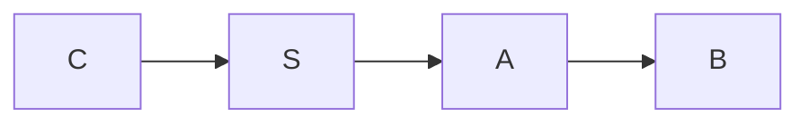

# Practice

:::question{#even type=mcq marks=1}
Which number is divisible by both 2 and 3?

- 9
- 12
- 15
- 20
:::

:::solution{#even answer=B}
A number divisible by 2 and by 3 is divisible by 6. Only $12 = 6 \times 2$ qualifies.
:::

:::question{#round type=nat marks=1}
Write $\frac{5}{8}$ as a decimal rounded to two places.
:::

:::solution{#round answer=0.62:0.63}
$5 \div 8 = 0.625$. Rounding to two places gives $0.63$ (some conventions round half to even, $0.62$, so both are accepted).
:::

:::question{#chart type=msq marks=1}
Which days sold more than 5 items?

```chart
{"type":"bar","title":"Items sold","data":[{"day":"Mon","sold":4},{"day":"Tue","sold":7},{"day":"Wed","sold":6},{"day":"Thu","sold":3}],"series":[{"key":"sold","name":"Items"}],"xKey":"day"}
```

- Mon
- Tue
- Wed
- Thu
:::

:::solution{#chart answer="B,C"}
Tuesday (7) and Wednesday (6) are above 5.
:::

# Exam

:::question{#odd type=mcq marks=2 difficulty=easy}
Which number is odd?

- 14
- 21
- 30
- 42
:::

:::question{#select-even type=msq marks=2 difficulty=easy}
Select all even numbers.

- 2
- 4
- 5
- 7
:::

:::question{#third type=nat marks=2 difficulty=medium}
Enter $7/3$ to two decimal places.
:::

:::question{#reach type=mcq marks=2 difficulty=hard}
In this graph, which node can you reach from **S**?



- C
- B
- Neither
- A
:::

# Solutions

:::solution{#odd answer=B}
21 leaves a remainder of 1 when divided by 2. The others are multiples of 2.
:::

:::solution{#select-even answer="A,B"}
2 and 4 are divisible by 2; 5 is not.
:::

:::solution{#third answer=2.32:2.34}
$7/3 = 2.333\ldots$, so any value from 2.32 to 2.34 is accepted.
:::

:::solution{#reach answer=B}
Follow the arrows: S → A → B. The edge between C and S points into S, so C is not reachable.
:::
